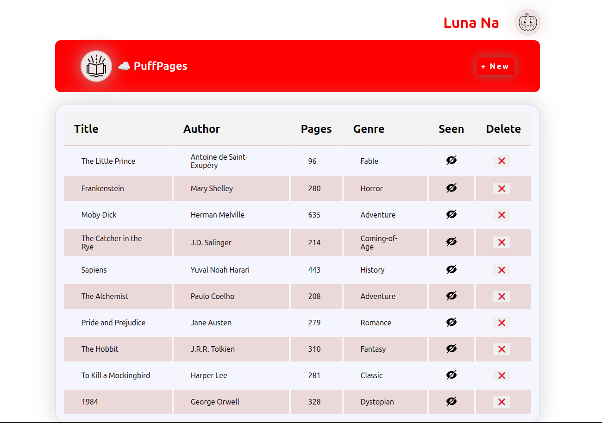

# Library


## 📚 My PuffPages ☁️ — Book Library Web App

A cute and functional web app to **add**, **view**, **toggle seen**, and **delete books** from your personal book list!

Built with **JavaScript**, **HTML**, and **CSS**.

---

### 🖼️ Preview

> 


---

### 🚀 Features

✅ Add books with title, author, pages, and genre
✅ Mark books as **seen/unseen** by clicking the 👁️ icon
✅ Delete any book with a ❌ button
✅ All books displayed in a neat HTML table
✅ Book input through a beautiful modal dialog box

---

### 📂 File Structure

```
📁 MyBooky
│
├── index.html         # Main webpage
├── style.css          # All styles
├── script.js          # JavaScript logic
├── Assets/            # All image assets used
│   ├── unseen.png
│   ├── seen.png
│   ├── littleBook.png
│   ├── cute-pumpkin.png
```

---

### 💡 How It Works

* Book list is stored in an array of objects (`myLibrary`)
* Each book includes: title, author, pages, genre, and seen image path
* Clicking "+ New" opens a dialog box to input book details
* Clicking the 👁️ toggles `seen.png` / `unseen.png`
* Clicking ❌ deletes the book row from the array and re-renders

---

### 🛠️ Technologies Used

* HTML5
* CSS3
* JavaScript (DOM manipulation)

---

### ✨ Image Credits

All icons and images are from:
👉 [Icons8](https://icons8.com)

* [👁️ Seen / Unseen Icons](https://icons8.com/icons/set/eye)
* [📚 Book Icon](https://icons8.com/icons/set/book)
* [🎃 Cute Pumpkin Icon](https://icons8.com/icons/set/pumpkin)

Thank you [Icons8](https://icons8.com) for the lovely assets!

---

### 📌 Tips for Customization

* Add more genres in the `<select>` tag
* Add a filter or search box to find books
* Save to `localStorage` so your list stays after refreshing!

---
By
@elanthinks
✨  
